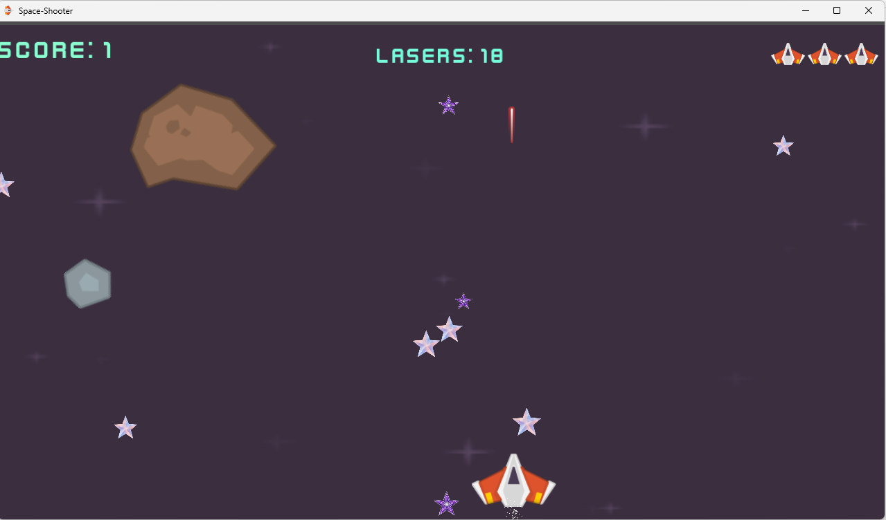

# 🚀 Space Shooter – Godot 4.5

A fast-paced 2D space shooter built using **Godot 4.5**, featuring smooth controls, shooting mechanics, particle effects, and UI systems.

---

## 🎮 Gameplay

- Control a spaceship and survive enemy attacks  
- Shoot enemies using a laser system  
- 🎯 **Win the game by reaching a score of 30**  
- Health system with visual indicators  
- Game Over system with restart support  

---

## ✨ Features

- 🔫 Shooting system with cooldown (Timer-based)
- 💥 Explosion effects using `GPUParticles2D`
- ❤️ Health system with UI (hearts)
- 🎵 Sound effects + background music
- 📊 Real-time score system
- 🏆 Win condition (Score = 30)
- 🔁 Scene management (Start → Game → Game Over)
- ⚡ Smooth player movement

---

## 🧠 Technical Highlights

Uses Godot Groups for communication:

```gdscript
get_tree().call_group("ui", "set_score", score)
```

### 🧩 Organized Scene Structure

- player
- laser
- enemy
- ui
- level

---

### 🔫 Shooting System

- Controlled by Timer (fire rate)
- Prevents spam shooting

---

### 💥 Particle Systems

- Explosion effects  
- Ship exhaust (local/global coordinates handled correctly)

---

## 🕹 Controls

| Key | Action |
|-----|--------|
| Arrow Keys | Move |
| Space | Shoot |
| R | Restart |

---

## 📦 Installation

Clone the repository:

```bash
git clone https://github.com/nonakarim/godot-space-shooter.git
```

Open the project using **Godot 4.5** and run ▶️

---

## 🎥 Demo

▶️ [Watch Gameplay Video](Demo/demo.mp4)

---

## 📸 Screenshot



---

## 📌 Version

### v1.0

- Core gameplay implemented  
- Shooting system  
- Enemy interactions  
- Score system with win condition (30)  

---

## 👨‍💻 Author

Made by **Hana** 🎮  
With support from My brother [Joo](https://github.com/jookarim)

---

## 💡 Notes

This project focuses on:

- Clean structure  
- Game feel  
- Real-time systems (shooting, UI, particles)  
